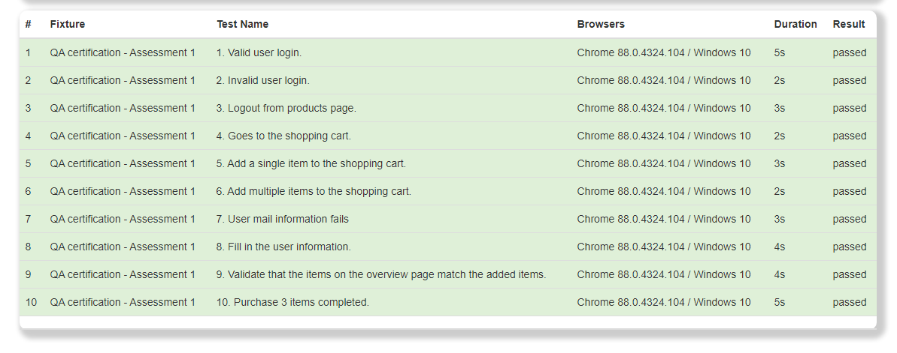

# QA Automation Certification

This repository contains my challenge exercises to get the QA Certification from Wizeline


## Installation

1. Clone this repository:

    ```sh
    git clone https://github.com/ruvaz/testcafe-qa-certification.git
    ```

2. Go to the project's root directory:

    ```sh
    cd qa-certification
    ```

3. Install the dependencies:

    ```sh
    npm install
    ```


## Usage

Use the `test-pc-browsers` script to run all tests in Chrome,Firefox and Edge at the same time.

```sh
npm run test-pc-browsers
```

Use the `test-all-chrome` script to run all tests in Chrome only.

```sh
npm run test-all-chrome
```

Use the `test-all-report` to get results in html report, you will find the file in the path: ./reports/report.html



```sh
npm run test-all-report
```

Use the `test-mobile-emulated` script to run all the tests in mobile emulation in chrome.

```sh
npm run test-mobile-emulated
```

Use the `test-mobile-qr` script to run all tests on a mobile using a QR code.

```sh
npm run test-mobile-qr
```

## Test in this Repository

## Assessment session 1

The repository includes the following examples:

1. Login with a valid user.
2. Login with an invalid user.
3. Logout from product's page.
4. Navigate to the shopping cart.
5. Add a single item to the shopping cart.
6. Add multiple items to the shopping cart
7. Continue with missing mail information
8. Fill user's information
9. Final order items
10. Complete a purchase
